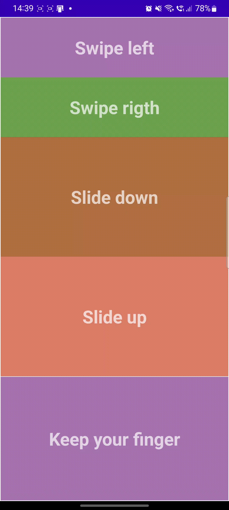

# Gesture detection

This app records finger movements and change the color of a view according to the movement.

## Movements you can record

- Swipe left

- Swipe right

- Slide down

- Slide up

The next *gif* show the performance of the app.



## Important part of the code 

```java
    @Override
    public void onLongPress(MotionEvent motionEvent) {
        View view5 = findViewById(R.id.view5);
        view5.setBackgroundResource(R.color.cardColor5_hover);
    }

    @Override
    public boolean onFling(MotionEvent motionEvent, MotionEvent motionEvent1, float v, float v1) {
        try {
            float diffY = motionEvent1.getY() - motionEvent.getY();
            float diffX = motionEvent1.getX() - motionEvent.getX();

            if (Math.abs(diffX) >Math.abs(diffY)){
                if (Math.abs(diffX)> 100 && Math.abs(v)>100){
                    if (diffX>0){
                        View view1 = findViewById(R.id.view1);
                        view1.setBackgroundResource(R.color.cardColor1_hover);
                    }else {
                        View view2 = findViewById(R.id.view2);
                        view2.setBackgroundResource(R.color.cardColor1_defaul);
                    }
                }
            }else{
                if (diffY>0){
                    View view3 = findViewById(R.id.view3);
                    view3.setBackgroundResource(R.color.cardColor3_hover);
                }else if(diffY<0){
                    View view4 = findViewById(R.id.view4);
                    view4.setBackgroundResource(R.color.cardColor2_defaul);
                }
            }

        }catch (Exception e){
            e.printStackTrace();
        }
        return false;
    }

```
